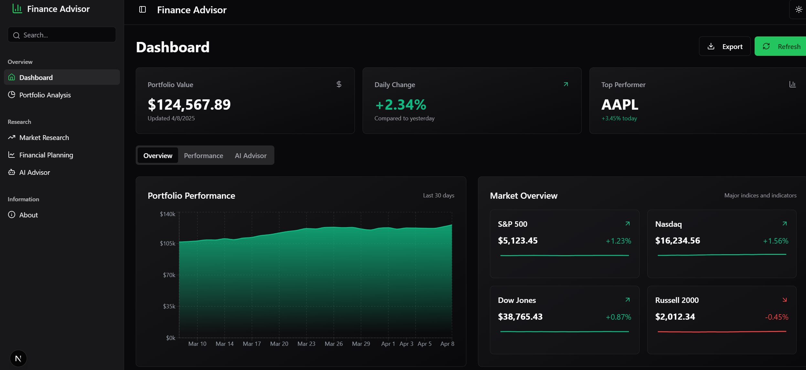
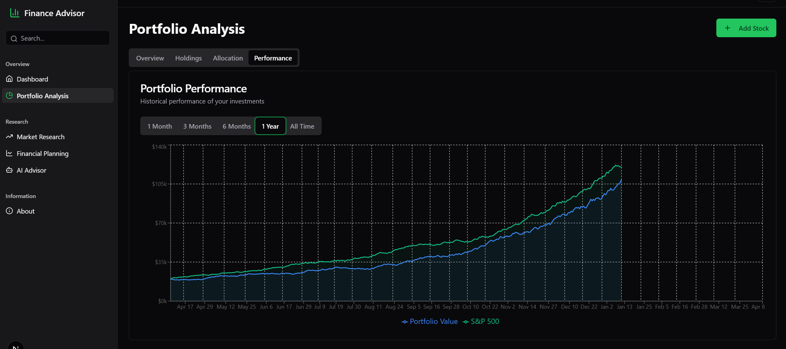
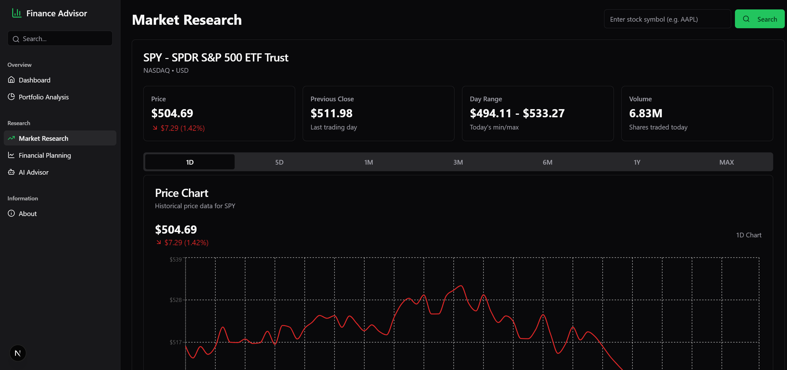
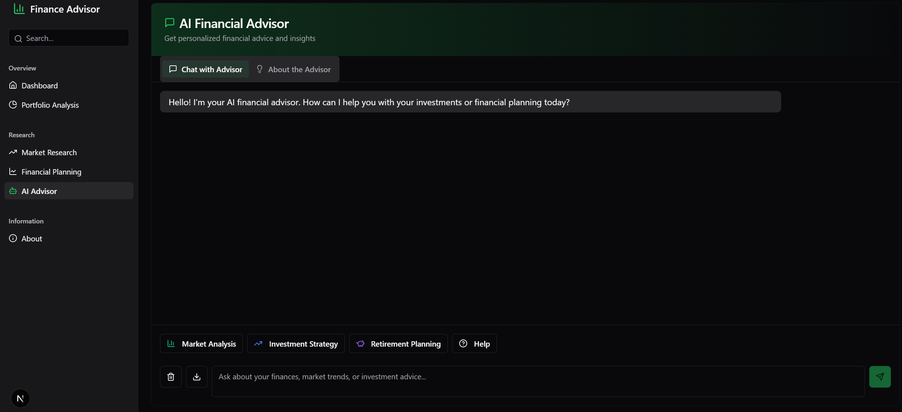

# Finance Advisor

<div align="center">
  
  <h3>AI-Powered Financial Analysis and Advisory Platform</h3>
  <p>Make informed investment decisions with real-time data and personalized AI guidance</p>
</div>

## ✨ Features

Finance Advisor is a comprehensive financial platform designed to help users manage investments, analyze market trends, and receive personalized financial advice.

### 📊 Interactive Dashboard
- Real-time portfolio performance tracking
- Market indices overview with live updates
- Asset allocation visualization
- Top performing stocks highlights
- Recent financial news integration

### 💼 Portfolio Management
- Detailed portfolio tracking with performance metrics
- Stock addition and removal with real-time data
- Allocation analysis and rebalancing tools
- Performance comparison with market benchmarks
- Historical performance visualization

### 📈 Market Research
- Real-time stock data and price charts
- Multiple timeframe analysis (1D, 5D, 1M, 3M, 6M, 1Y, MAX)
- Stock details with key financial metrics
- Trading volume analysis
- Latest financial news for specific stocks

### 🤖 AI Financial Advisor
- Personalized financial advice based on your portfolio
- Natural language interaction for financial queries
- Market analysis and investment recommendations
- Retirement and financial planning guidance
- Tax optimization suggestions

### 📝 Financial Planning
- Retirement calculator with customizable parameters
- Budget planner for income and expense tracking
- Financial goal setting and progress tracking
- Interactive charts for financial projections

## 🚀 Technologies Used

### Frontend
- **React & Next.js**: For a responsive, server-side rendered application
- **Tailwind CSS**: For modern, utility-first styling
- **Framer Motion**: For smooth animations and transitions
- **Recharts**: For interactive data visualizations
- **shadcn/ui**: For accessible, reusable UI components

### Backend & Data (en cours)
- **Yahoo Finance API**: For real-time market and stock data
- **Stock News API**: For financial news and updates
- **Local Storage**: For caching and persistence
- **Environment Variables**: For secure API key management

### AI & Machine Learning (en cours)
- **Gemini 2.0 Flash API**: For natural language processing and financial advice
- **Context-aware Conversation**: For personalized financial insights
- **Conversation Memory**: For consistent user experience

### DevOps & Deployment(en cours)
- **VStill**: For continuous deployment and hosting
- **Environment Variable Management**: For secure API access
- **Optimized Build Process**: For performance

## 📸 Screenshots

<div align="center">
  
  
  
  
</div>

## Installation


### Prerequisites

Before you begin, make sure you have the following installed:

- [Node.js](https://nodejs.org/) (v18 or higher recommended)
- [Git](https://git-scm.com/)

#### Install `pnpm`

If you don’t have `pnpm` installed, you can install it globally using `npm`:

```bash
npm install -g pnpm
```

You can verify the installation by running:

```bash
pnpm -v
```

---

###  Setup

1. **Clone the repository**
```bash
git clone https://github.com/Sheris-Milly/test5
cd finance-advisor
```

2. **Install dependencies**
```bash
pnpm install
```

3. **Set up environment variables**  
   Create a `.env.local` file in the root directory with the following:
```
NEXT_PUBLIC_RAPIDAPI_KEY=your_rapidapi_key
NEXT_PUBLIC_GEMINI_API_KEY=your_gemini_api_key
```

4. **Run the development server**
```bash
pnpm dev
```

5. **Open in your browser**  
   Go to: [http://localhost:3000](http://localhost:3000)


Sure! Here's the cleaned-up and properly formatted **Project Structure** section for your `README.md`:

---

## Project Structure

```
finance-advisor/
├── app/                  # Next.js App Router pages and layout
├── components/           # Reusable React components
│   ├── about/            # Components for the About page
│   ├── advisor/          # Components related to the AI advisor
│   ├── dashboard/        # Dashboard UI and widgets
│   ├── market/           # Market research and data components
│   ├── planning/         # Financial planning tools
│   ├── portfolio/        # Portfolio analysis and insights
│   └── ui/               # Shared UI components (e.g., from shadcn)
├── lib/                  # Core libraries and helper logic
│   ├── api/              # API clients and integrations (e.g. Yahoo Finance)
│   └── utils.ts          # Utility functions
├── public/               # Static files (images, icons, etc.)
└── README.md             # Project documentation
```

